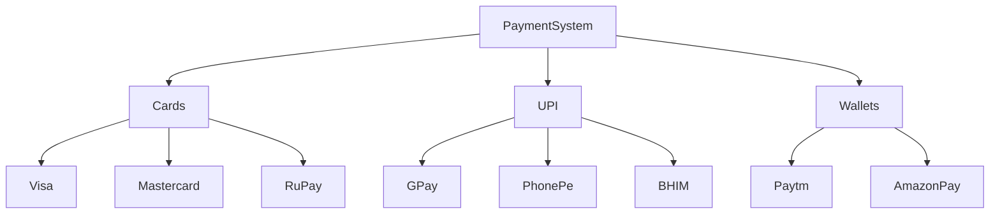

# Payment Gateway Orchestration Engine

A production-grade C++ lock-free concurrent tree system modeling.

## Architecture


```mermaid
graph TD
    A[PaymentSystem] --> B[Cards]
    A --> C[UPI]
    A --> D[Wallets]
    B --> E[Visa]
    B --> F[Mastercard]
    B --> G[RuPay]
    C --> H[GPay]
    C --> I[PhonePe]
    C --> J[BHIM]
    D --> K[Paytm]
    D --> L[AmazonPay]
```

## Build

```bash
make
./payment_engine
```