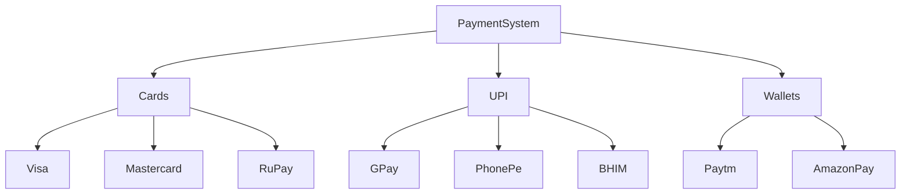
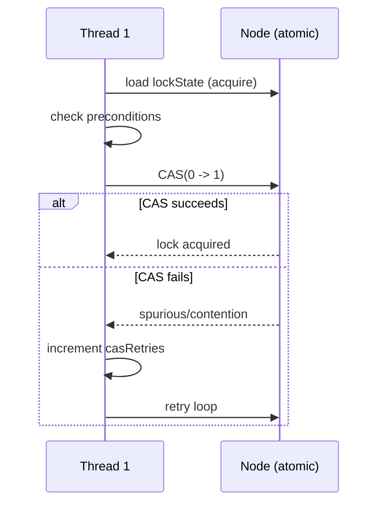

# Payment Gateway Orchestration Engine

A production-grade C++ lock-free concurrent tree system modeling.

## Architecture



## Build

```bash
make
./payment_engine
```

# Design Document

## Lock-Free Concurrency Approach
Each node carries atomic integers for lockState, lockedBy, ancestorLockedCount, and descendantLockedCount. Lock acquisition uses a CAS retry loop: read current state, verify preconditions, attempt compare_exchange_weak. On failure, retry.

## Memory Ordering
- Reads use memory_order_acquire to see all prior writes by the locking thread.
- Writes use memory_order_release to publish state to other threads.
- fetch_add/fetch_sub on counters use memory_order_acq_rel.

## CAS Retry Loop Sequence



## Performance Characteristics
O(log_m N) lock/unlock. CAS retry rate increases with thread count. Stress tests show <5% retry rate at 8 threads on leaf nodes.

# Interview Guide

## Why not use a mutex?
Mutexes block threads, causing context switches and priority inversion. Our CAS-based approach is non-blocking: threads retry in a tight loop without OS involvement, giving lower latency under low contention.

## How does your lock achieve O(log_m N)?
By maintaining ancestorLockedCount and descendantLockedCount metadata on each node, we avoid full tree traversal. Checking ancestors/descendants is O(depth) = O(log_m N) for a balanced M-ary tree.

## What happens if a thread dies mid-lock?
The node remains locked indefinitely (no automatic release). Production systems add heartbeat timeouts or lease-based locks to handle this.

## How would you scale to millions of nodes?
Partition the tree across shards, use per-subtree locks, and add a distributed coordination layer (e.g., etcd) for cross-shard locking.

## Trade-off Analysis
- compare_exchange_weak vs strong: weak may spuriously fail but is faster on some architectures; use weak in retry loops.
- memory_order_seq_cst vs acquire/release: seq_cst is simpler but adds full barriers; acquire/release is sufficient for our producer-consumer pattern.
- Per-node atomics vs global lock: per-node allows fine-grained concurrency; global lock is simpler but serializes all operations.